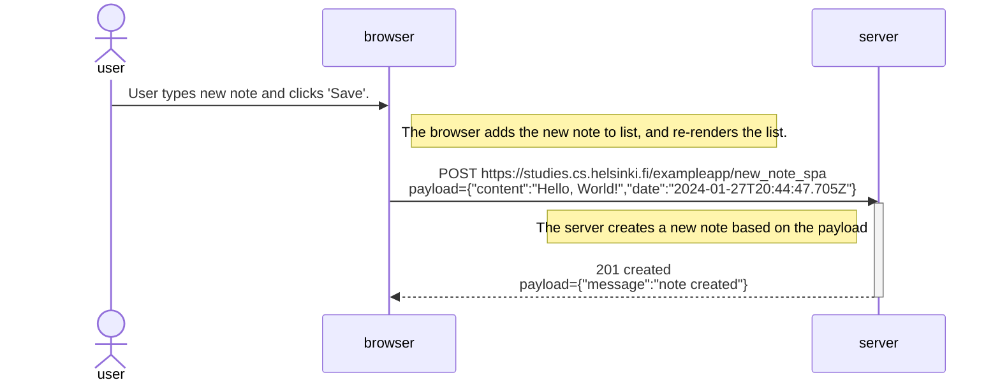

```mermaid
sequenceDiagram
  actor user
  participant browser
  participant server

  
  user ->> browser: User types new note and clicks 'Save'.
  
  Note right of browser: The browser adds the new note to list, and re-renders the list.
  browser->>server: POST https://studies.cs.helsinki.fi/exampleapp/new_note_spa <br/> payload={"content":"Hello, World!","date":"2024-01-27T20:44:47.705Z"}

  activate server
  Note left of server: The server creates a new note based on the payload
  server-->>browser: 201 created <br/> payload={"message":"note created"}
  deactivate server
  
```
